# HealthSync 

HealthSync Gem is a full-stack healthcare coordination platform that helps patients understand medical reports and prescriptions while giving doctors a focused dashboard for patient monitoring, appointments, notifications, and risk analytics.

The project combines a React frontend with an Express/MongoDB backend and AI-powered support for report explanation, prescription translation, and doctor assistance. It is designed as a practical healthcare workflow prototype: patients can upload reports, review risk summaries, ask health questions, translate prescriptions into simple language, and book appointments; doctors can monitor patients, review uploaded reports, manage appointments, and track high-risk trends.

## Implementation Screenshots

The `Assets/` folder contains implementation screenshots that show the main user journeys and completed UI screens.

### Landing and Authentication

| Welcome Screen | Welcome Flow | Login |
|---|---|---|
| 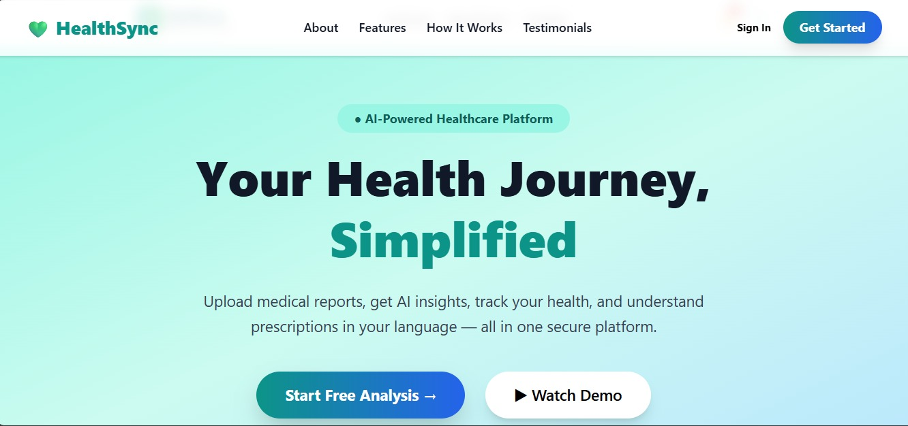 | 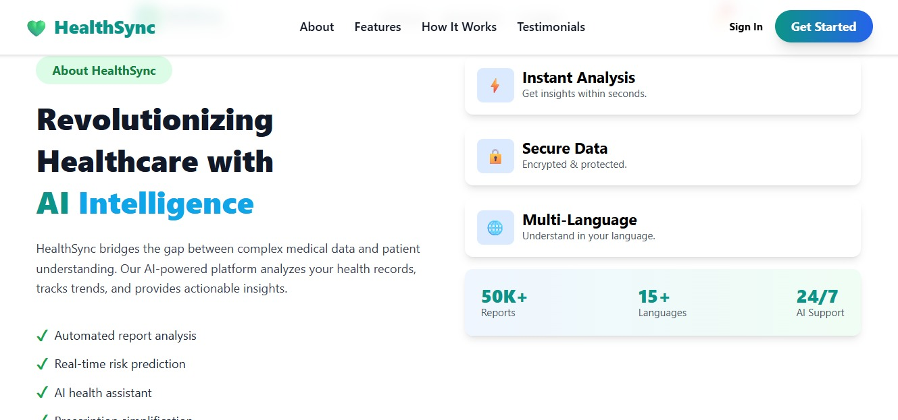 | 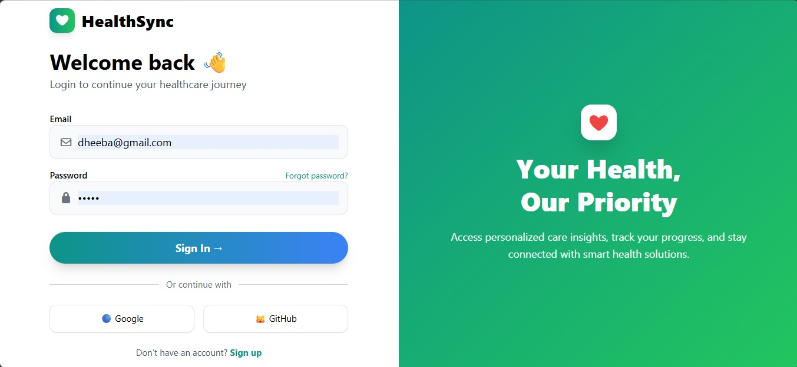 |

| Signup | Feature Highlights | How It Works |
|---|---|---|
| 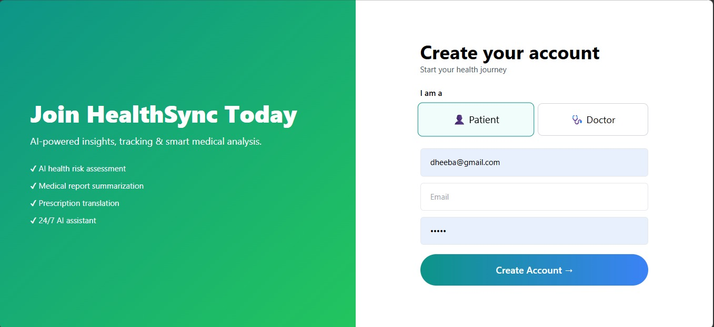 | 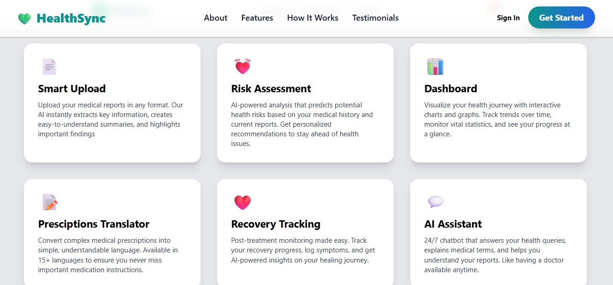 | 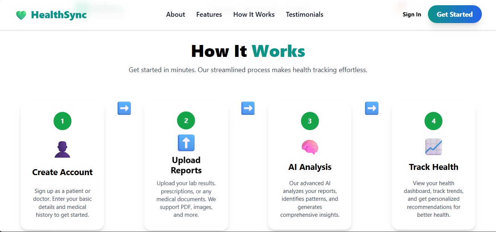 |

### Patient Experience

| Patient Dashboard | Patient Analytics | Appointment Booking |
|---|---|---|
| 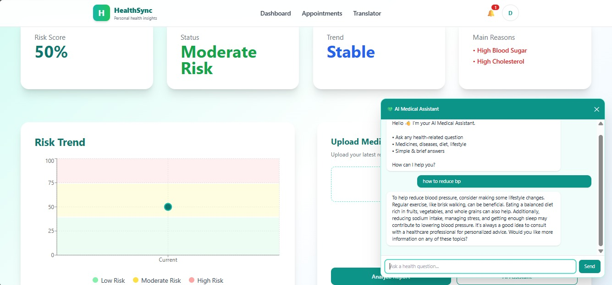 | 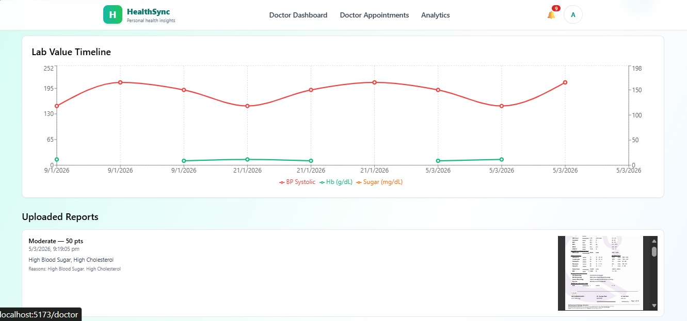 | 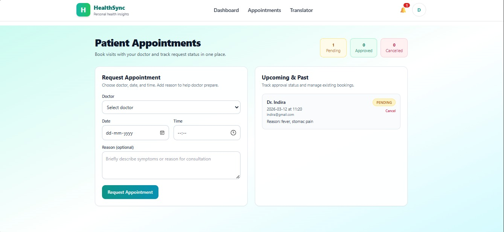 |

### Prescription Tools

| Prescription Upload | Prescription Translator |
|---|---|
| 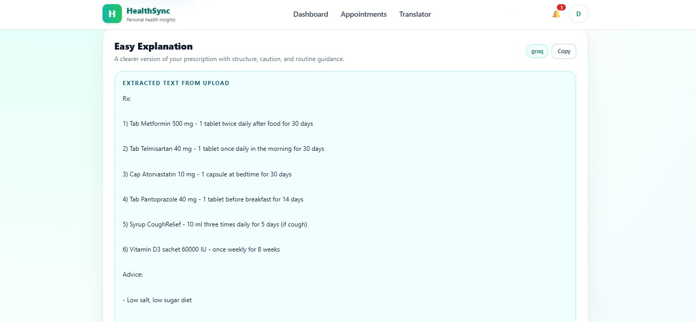 | 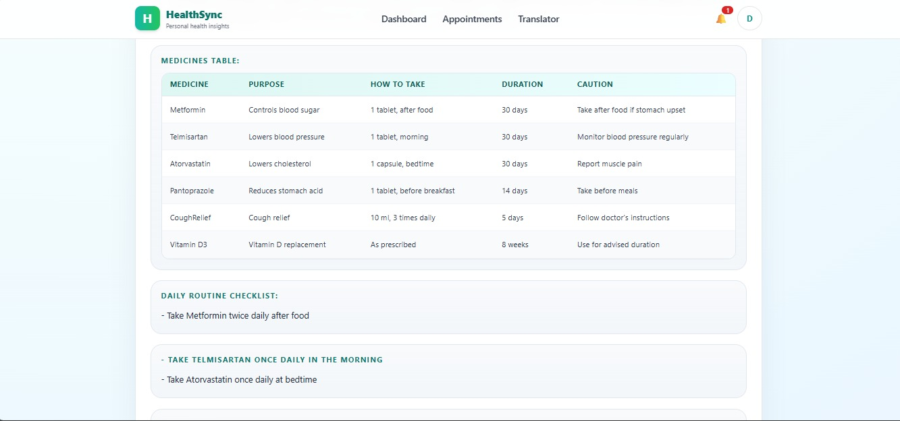 |

### Doctor Experience

| Doctor Dashboard | Doctor Appointments |
|---|---|
| 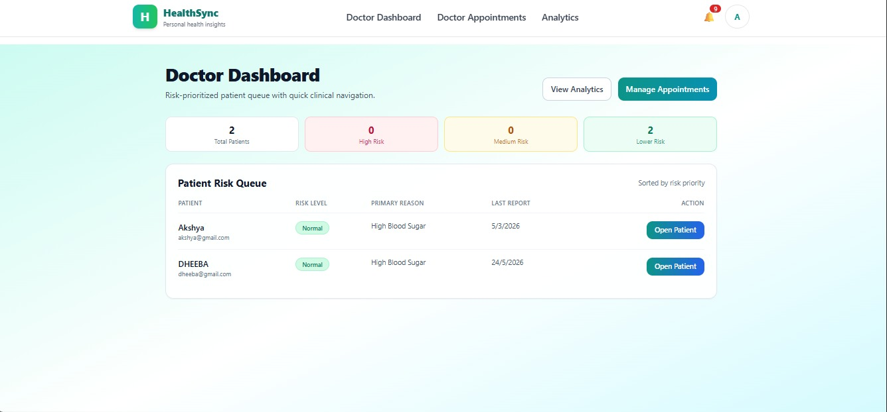 | 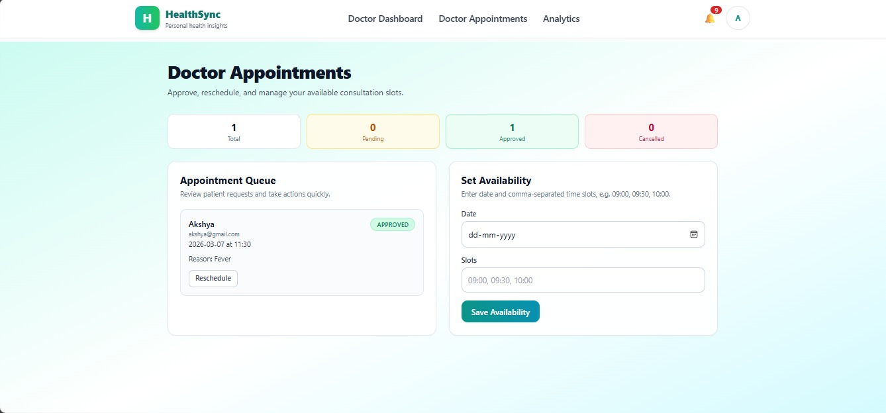 |

## Project Idea

Medical information is often scattered across reports, prescriptions, appointments, and doctor follow-ups. HealthSync Gem brings these pieces into one application:

- Patients get a simple dashboard for reports, risk history, appointments, notifications, profile settings, and prescription translation.
- Doctors get a clinical dashboard for patient lists, patient detail views, analytics, appointment management, and AI-assisted patient context.
- The backend stores users, reports, notifications, appointments, availability, risk history, action history, and doctor interactions in MongoDB.
- AI services help convert complex medical language into patient-friendly summaries while keeping the app clear that it does not replace professional medical advice.

## Scope

This repository covers the core MVP and prototype scope:

- User authentication for patients and doctors.
- Role-based routing and protected backend endpoints.
- Medical report upload and basic risk scoring.
- Report history storage and doctor review workflow.
- Patient appointment requests and doctor approval/rescheduling.
- Doctor availability slots.
- Real-time-style notification records for key events.
- Doctor analytics for high-risk patients and weekly trends.
- Prescription translation from text or uploaded files.
- AI assistant flows for patient-facing and doctor-facing questions.

Out of scope for the current version:

- Production-grade clinical diagnosis.
- Real-time chat sockets.
- Payment, insurance, or hospital billing.
- EHR/EMR integrations.
- Production deployment hardening and compliance certification.

## Features

### Patient Features

- Signup and login with JWT authentication.
- Patient dashboard with health report status and risk information.
- Upload medical PDF reports for analysis.
- View report history and trends.
- Ask AI questions using report context.
- Translate prescriptions into simple language.
- Upload prescription files in PDF, image, TXT, or DOCX formats.
- Select output language for prescription explanation: English, Tamil, Tanglish, or Hindi.
- Book appointments with doctors.
- View and cancel appointments.
- Receive notifications for report reviews, appointment updates, and risk alerts.
- Update profile details and avatar.
- Select a preferred doctor.

### Doctor Features

- Doctor dashboard with patient monitoring.
- View patient list sorted by risk.
- Open patient detail pages with reports and history.
- Mark reports as reviewed.
- Use doctor AI assistant with patient context.
- View and manage appointment requests.
- Approve or reschedule appointments.
- Set availability slots.
- View analytics including total patients, high-risk count, recovery delay, weekly high-risk trend, and risk breakdown.
- Receive notifications for new reports, appointment requests, and high-risk reports.

### AI Features

- Patient AI assistant endpoint using recent report context.
- Prescription translation and explanation with Groq first, Gemini fallback, and structured local fallback.
- File extraction for prescription uploads:
  - PDF via `pdf-parse`
  - DOCX via `mammoth`
  - Images via Gemini file input
  - Text-based files via UTF-8 parsing
- Report analysis service using Google Generative AI for summary-style analysis.

## Tech Stack

### Frontend

- React 18
- Vite
- React Router
- Axios
- Tailwind CSS
- Recharts
- Font Awesome

### Backend

- Node.js
- Express
- MongoDB with Mongoose
- JWT authentication
- bcryptjs password hashing
- express-fileupload
- pdf-parse
- mammoth
- Google Generative AI SDK
- Groq OpenAI-compatible chat completions API

## Folder Structure

```text
healthsync_gem/
|-- Assets/
|   |-- appointmentbook.jpeg
|   |-- dashboard.jpeg
|   |-- doctorappoint.jpeg
|   |-- doctordash.jpeg
|   |-- features.jpeg
|   |-- howitworks.jpeg
|   |-- login.jpeg
|   |-- patientanalytics.jpeg
|   |-- prescription.jpeg
|   |-- signup.jpeg
|   |-- translator.jpeg
|   |-- welcome1.jpeg
|   `-- welcome2.jpeg
|-- backend/
|   |-- config/
|   |   `-- db.js
|   |-- controllers/
|   |-- middleware/
|   |-- models/
|   |-- routes/
|   |-- services/
|   |-- uploads/
|   |-- package.json
|   `-- server.js
|-- frontend/
|   |-- src/
|   |   |-- components/
|   |   |-- pages/
|   |   |-- services/
|   |   |   `-- api.js
|   |   |-- App.jsx
|   |   |-- index.css
|   |   `-- main.jsx
|   |-- index.html
|   |-- package.json
|   |-- tailwind.config.js
|   `-- vite.config.js
|-- .gitignore
|-- README.md
`-- backend/.env.example
```

## Backend API Overview

Base URL during local development:

```text
http://localhost:5000/api
```

Main route groups:

- `POST /auth/signup` - create patient or doctor account.
- `POST /auth/login` - login and receive JWT.
- `GET /auth/me` - fetch authenticated profile.
- `PUT /auth/me` - update profile and avatar.
- `POST /reports/analyze` - upload and analyze a medical report.
- `GET /reports/history` - fetch report history for the logged-in patient.
- `POST /doctor/reports/:id/review` - mark a report as reviewed.
- `GET /doctor/patients` - doctor patient list.
- `GET /doctor/patients/:id` - doctor patient detail view.
- `POST /doctor/ai-assistant` - doctor AI assistant question.
- `GET /doctor/analytics` - doctor analytics metrics.
- `POST /appointments` - patient appointment request.
- `GET /appointments` - patient appointments.
- `PATCH /appointments/:id/cancel` - cancel appointment.
- `GET /doctor/appointments` - doctor appointment list.
- `PATCH /doctor/appointments/:id` - approve or reschedule appointment.
- `POST /doctor/availability` - doctor sets availability.
- `GET /appointments/availability` - read availability.
- `GET /notifications` - fetch notifications.
- `PATCH /notifications/:id/read` - mark notification as read.
- `PATCH /notifications/mark-all-read` - mark all notifications as read.
- `POST /prescription/translate` - translate/explain prescription from text or uploaded file.
- `POST /ai` - patient AI assistant endpoint.

## Data Models

The backend uses MongoDB collections through Mongoose models:

- `User` - patient and doctor accounts.
- `Report` - extracted report text, risk score, status, summary, reasons, PDF URL, review metadata.
- `RiskHistory` - patient risk timeline.
- `Appointment` - patient-doctor appointments.
- `AppointmentHistory` - appointment status transitions.
- `Availability` - doctor availability slots.
- `Notification` - user notifications for important events.
- `DoctorInteraction` - doctor AI assistant history.
- `ActionHistory` - audit-style records for important actions.

## Setup Instructions

### Prerequisites

- Node.js 18 or newer.
- MongoDB connection string.
- Groq API key for the main chat/translation AI flows.
- Gemini API key for report analysis and image prescription extraction.

### 1. Clone the Repository

```bash
git clone <your-repository-url>
cd healthsync_gem
```

### 2. Configure Backend Environment

Create `backend/.env` from the example file:

```bash
cp backend/.env.example backend/.env
```

Fill in your values:

```env
PORT=5000
MONGO_URI=your_mongodb_connection_string
JWT_SECRET=your_jwt_secret
GROQ_API_KEY=your_groq_api_key
GEMINI_API_KEY=your_gemini_api_key
```

### 3. Install Backend Dependencies

```bash
cd backend
npm install
```

### 4. Start Backend

```bash
npm run dev
```

Backend runs on:

```text
http://localhost:5000
```

### 5. Install Frontend Dependencies

Open a second terminal:

```bash
cd frontend
npm install
```

### 6. Start Frontend

```bash
npm run dev
```

Frontend runs on the Vite URL shown in the terminal, commonly:

```text
http://localhost:5173
```

## Implementation Notes

- The frontend API client currently targets `http://localhost:5000/api`.
- JWT tokens are stored in browser local storage by the frontend flows.
- Uploaded avatars and reports are saved under `backend/uploads`.
- Generated files, installed dependencies, uploads, `.env`, token files, and sample medical documents are ignored by Git.
- The report risk scoring currently uses basic keyword/rule checks in addition to AI-oriented services.
- Prescription translation tries Groq first, Gemini second, and then returns a structured fallback if AI providers are unavailable.
- This project is a healthcare assistance prototype and should not be treated as a medical device or a replacement for a licensed doctor.


## Future Enhancements

- Add automated frontend and backend tests.
- Move frontend API base URL into environment variables.
- Add stronger medical report parsing and lab-value extraction.
- Add real-time notifications with WebSocket support.
- Add admin role and doctor verification.
- Add better audit logging and privacy controls.
- Add deployment configuration for frontend, backend, and database.
- Add cloud storage for uploaded reports and avatars.
- Improve accessibility and mobile responsiveness across every page.

## Disclaimer

HealthSync Gem provides educational summaries and workflow support only. It does not provide medical diagnosis, treatment decisions, or emergency support. Users should consult qualified healthcare professionals for medical advice.

